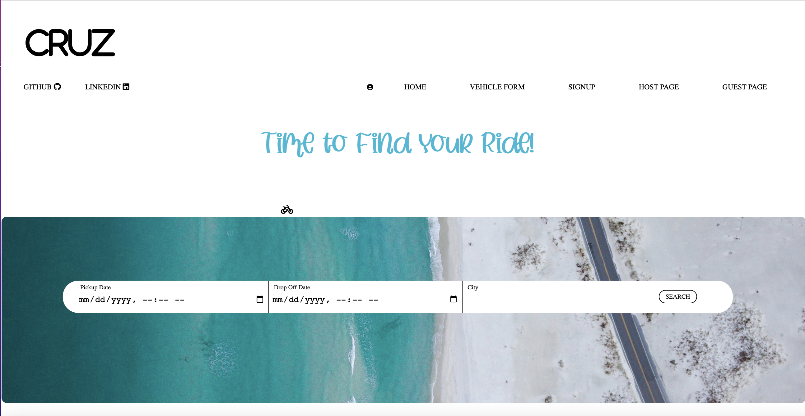
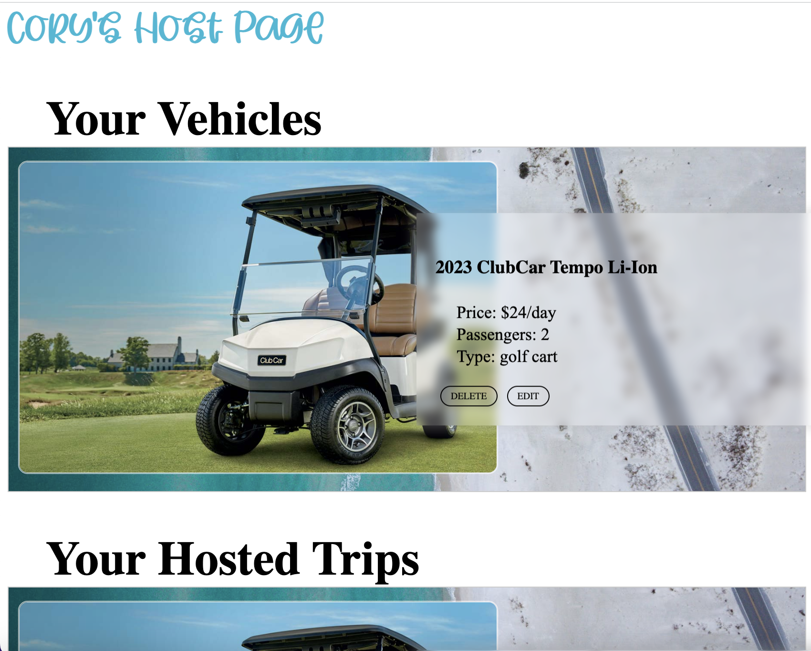

# CRUZ
### Cory Baker
- [LinkedIn](https://www.linkedin.com/in/cory-baker-9738ba2a/)
- [GitHub](https://github.com/Cbakes24)

Cruz is a service that offers guests and hosts the opportunity to rent out their vehicles for a specific period of time, creating a Fun Utility Vehicle (FUV) experience. This idea originated from living in a beach town where a car isn't always necessary for transportation. People seek more experiential travel and desire a hands-on and enjoyable ride. Additionally, Cruz provides an opportunity for vehicle owners to rent out their FUVs (golf carts, mopeds, e-bikes, scooters) in popular locations, creating an extra source of income.

Check out the live version of [CRUZ](https://crooz-web-service.onrender.com)

## Stack

### Backends
CRUZ uses **Python** as the backend language with frame-works such as **Flask** and **SQLalchemy** to handle database usage. This allows for
the backend routes to be accessed easily and save of data usage for faster more powerful website.

### Frontend
For front end of CRUZ uses **React.js** to create components along with with **Redux** for storing the state to create a clean looking and responsive website
that will feel very modern and easy to use for a user.

### Extra
Google-Maps
AWS

## Features

The design of CRUZ is meant to be simple and quick to use. The idea is to make it as easy as possible to a user to book a trip, look up information on vehicles, and
be able to check on any bookings past or present.
### Search Filter

The homepage immediately gives a user access to look up a vehicle based on it's location and date availability. This will instantly pull up a list
of vehicles that fit the criteria of your trip and allows users to book the trip right then and there or have the option to check the vehicle's profile out
for more detailed information.

Logic has been built in using JavaScript functions on React to prevent any over lapping dates/previous date selection. On the backend Redux is used to load the bookings state of each vehicle to determine if it has any bookings during the selected user dates and will filter them out if any bookings over lap.

### Guest/Host Profile Page
The Guest/Host pages feature full CRUD (GET, CREATE, EDIT, DELETE)for vehicles, bookings, and reviews. It also contains partial CRUD (GET, CREATE, DELETE) for favorite vehicles.

The Guest profile page is a feature where users will have access to all of their information regarding any upcoming bookings, previous bookings, and a favorite vehicles list to have quick access to desired FUVs. Reviews can only be left on previous bookings, that will show up on a vehicle's profile page.

The Host page will show a host their vehicles they have listed on the website and any upcoming/previous bookings with those vehicles. It also contains a vehicle form where a host can add a new vehicle or edit a current one.

## Technologies Used

- JavaScript
- Python
- React
- Redux
- SQLalchemly
- Flask
- Render
- PostgreSQL

## Running the Project

To set this up please refer to the SetUp folder of this repository. There you will find front/backend instructions for the set up. Enjoy!
